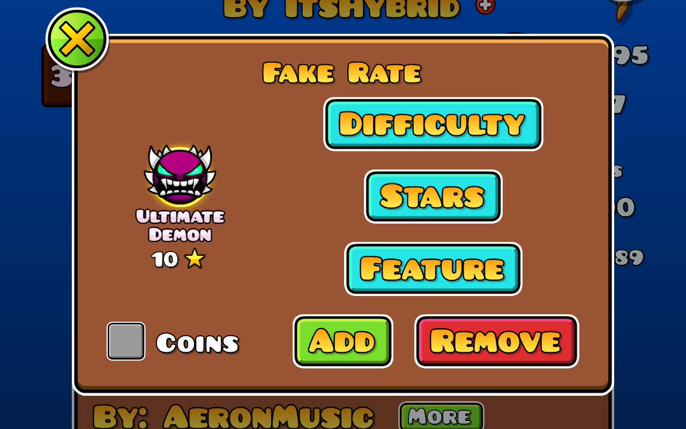
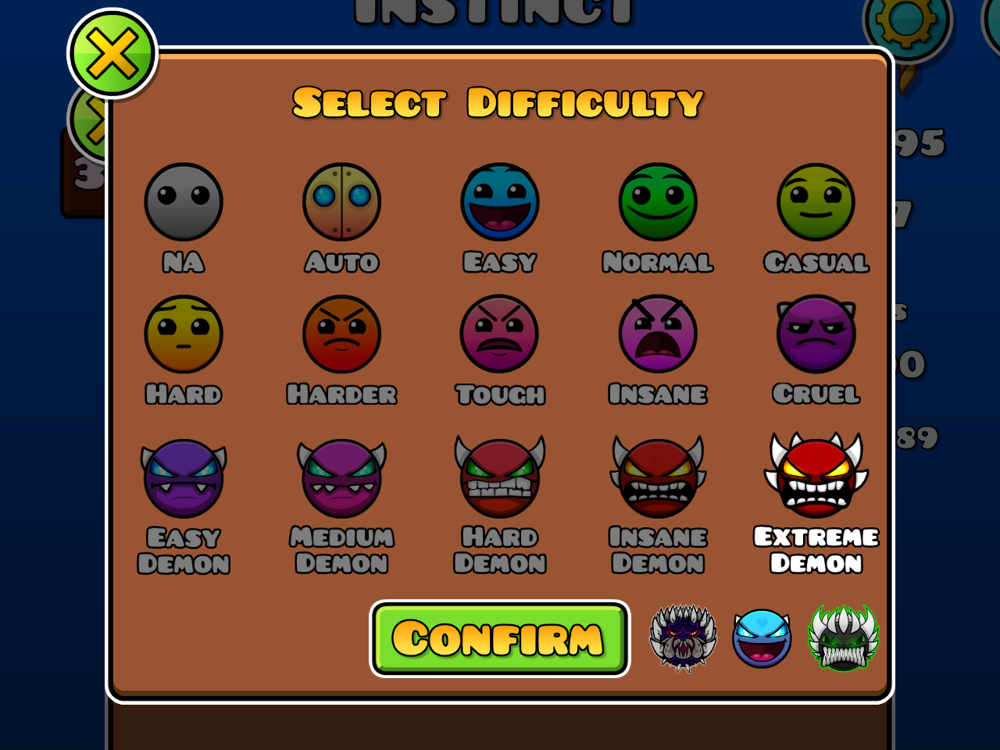
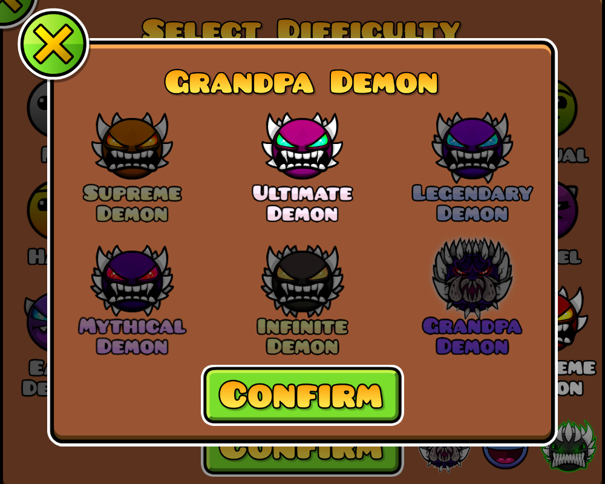
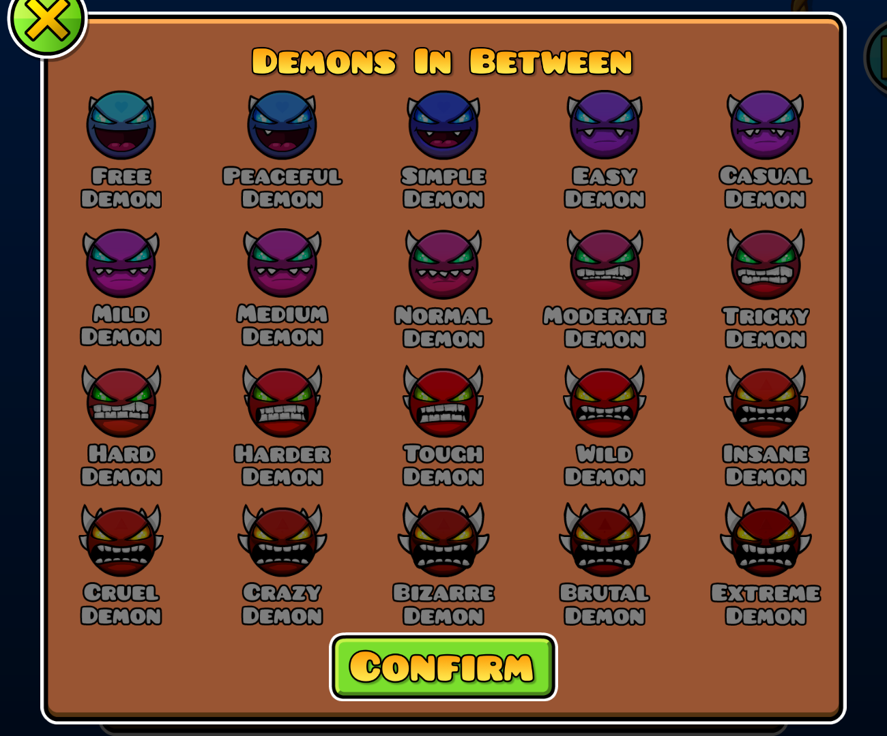
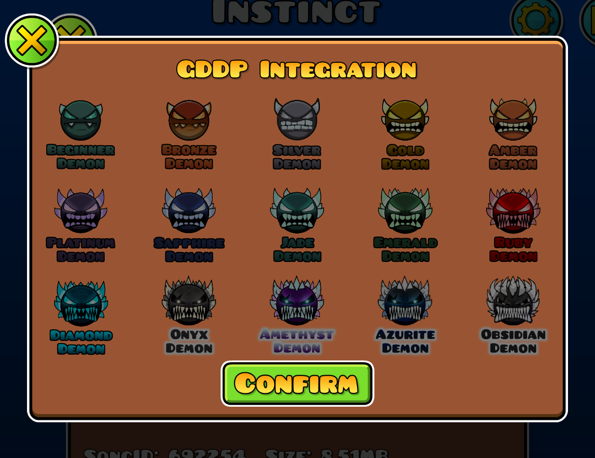
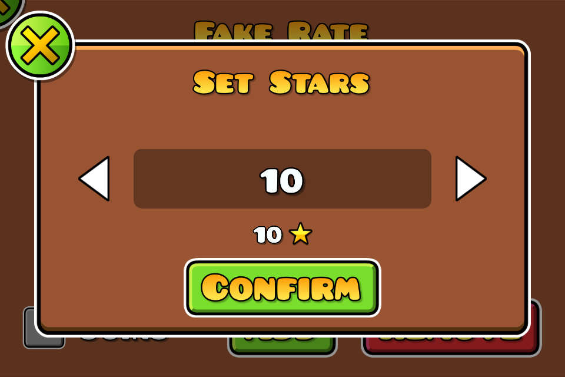
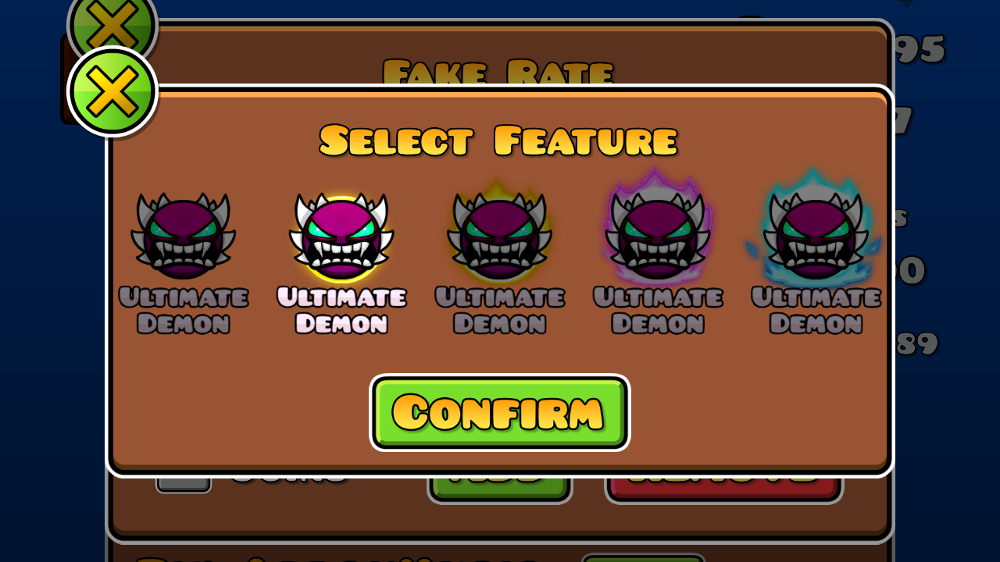

# Fake Rate
A mod that allows you to assign a fake rating to online levels.

# Features
- Ability to give online levels a fake rating, which can be done either through a button in the level info screen or by editing save data
- A popup that allows you to independently rate the level's difficulty, stars, feature status, and coin verification status
- Support for Grandpa Demon, Demons In Between, and GDDP Integration

# Credits
- [Uproxide](https://gdbrowser.com/u/25397826) - Some inspiration for the mod
- [hiimjustin000](https://gdbrowser.com/u/7466002) - Creator of the mod and the Demons In Between mod
- [ItzKiba](https://gdbrowser.com/u/4569963) - Creator of the Grandpa Demon mod
- [Minemaker0430](https://gdbrowser.com/u/6635071) - Creator of the GDDP Integration mod

# Gallery
\
\
\
\
\
\

# License
This mod is licensed under the [MIT License](./LICENSE).